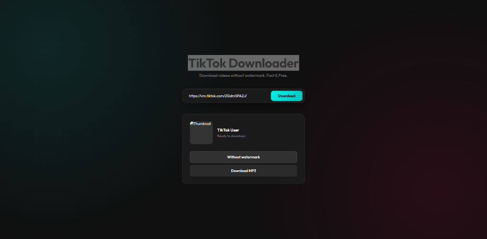

# TikLoader - Downloader Premium de TikTok 🎵

 
*(Se tiver um print da tela, coloque em public/screen.png e descomente a linha acima)*

**TikLoader** é uma aplicação web de alta performance que permite baixar vídeos do TikTok **sem marca d'água** em qualidade HD.

Desenvolvido com **Node.js** e um frontend moderno inspirado no **Tailwind**, ele replica a funcionalidade de serviços famosos como SSSTik, mas com uma interface mais limpa, sem anúncios e design premium.

---

## ✨ Recursos

- **Sem Marca d'água**: Pega o arquivo de vídeo direto dos servidores (CDN) do TikTok.
- **Qualidade HD**: Prioriza sempre a maior resolução disponível.
- **Extração de Áudio**: Opção para baixar apenas o MP3.
- **Interface Premium**: 
  - Modo Escuro (Dark Mode) por padrão.
  - Estética "Glow" em Ciano/Vermelho seguindo a marca do TikTok.
  - Totalmente responsivo (Funciona em Celular e PC).
- **Privacidade**: Sem logs, sem rastreamento de usuário.

---

## 🚀 Como Fazer o Deploy (Render.com)

Este projeto está pronto para subir no Render. Siga os passos:

1.  **Suba este repositório no seu GitHub** (`github.com/davemaciel`).
2.  Vá para o [Painel do Render](https://dashboard.render.com/).
3.  Clique em **New +** -> **Web Service**.
4.  Conecte o seu repositório.
5.  **Configure as opções**:
    - **Runtime**: `Node`
    - **Build Command**: `npm install`
    - **Start Command**: `npm start`
6.  Clique em **Create Web Service**.

Pronto! Seu downloader estará online em minutos.

---

## 🛠️ Rodando Localmente

Para rodar o projeto na sua máquina:

```bash
# 1. Clone o repositório
git clone https://github.com/davemaciel/tikloader.git

# 2. Instale as dependências
cd tikloader
npm install

# 3. Inicie o servidor
npm start
```

Abra [http://localhost:3000](http://localhost:3000) no seu navegador.

---

## ⚙️ Endpoint da API

### `POST /api/convert`

- **Corpo (Body)**: `{ "url": "https://vm.tiktok.com/..." }`
- **Resposta**:
  ```json
  {
    "success": true,
    "author": "Nome do Usuário",
    "thumbnail": "https://...",
    "links": [
      { "text": "Sem marca d'água", "href": "..." },
      { "text": "Baixar MP3", "href": "..." }
    ]
  }
  ```

---

## ⚠️ Aviso Legal

Este projeto é apenas para fins educacionais. Esta ferramenta não é afiliada, autorizada, mantida, patrocinada ou endossada pelo TikTok ou qualquer uma de suas afiliadas.
